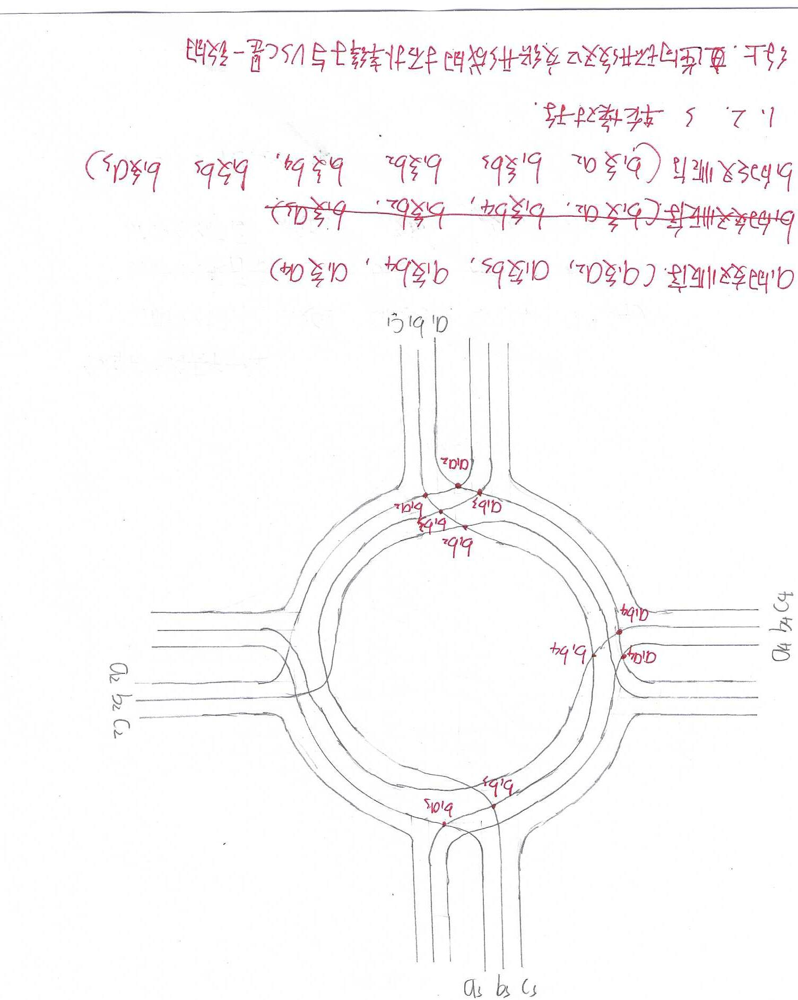

# 2026-011-顺时针环岛交通导流系统

> 一种顺时针环岛交通导流系统及通行方法，通过进岛车道预选出口、过渡道路最少交叉排列与两相位信号控制降低环岛内行驶干涉，并与传统环岛进行 VISSIM 对比仿真

## 项目效果图

## 项目内容

1. **项目定位**
道路交通领域的顺时针环岛交通导流方案。针对多岔路口常规红绿灯易拥堵、传统逆时针环岛因进出口不同需复杂变道而导致行驶干涉、通行效率差的问题。说明文档记载：本方案在 CN104452505A 对环岛改进的基础上拓展到多向环岛，将冲突点汇集到环岛出入口并配合红绿灯，使相位在增加环岛向数和车道数时始终保持为 2 相，同时避免环岛内外车道相互合流导致的死锁。
2. **导流系统构成**

- 中心岛，以及环绕中心岛呈放射状排布的 n 个双向行驶道路（左侧出岛、右侧进岛）；
- 每条行驶道路含 n-1 个进岛车道、n-2 个出岛车道；专利修改稿实施例为五向环岛，每向 4 进 3 出；
- 最右侧进岛车道经逆时针过渡车道连接右侧相邻道路最左侧出岛车道，供右转使用，该车道不设停止线；
- 其余进岛车道按序号经顺时针过渡道路连接对应行驶道路的对应出岛车道；
- 环岛内右转过渡道路排布在最外侧，其余按最少交叉原则交织排列；
- 专利修改稿附图标记：行驶道路、进岛车道、出岛车道、过渡道路，以及横跨环岛的人行道与非机动车道等修订标注。

3. **通行方法**

- S1：按所需出岛方向选择对应进岛车道，顺时针驶入环岛后从对应出岛车道驶离；右转至相邻道路则直接驶入最右侧进岛车道；
- S2：驶入环岛时，左转、右转均需让行正在环岛内行驶的车辆；
- S3：驶出环岛时，右转车辆需让行其他出环岛车辆。

4. **信号控制与 VISSIM 仿真**

- 两相位固定配时：第一相位为进岛车道与一侧人行道 / 非机动车道放行；第二相位为岛内直行、左转驶离及另一侧人行道 / 非机动车道放行；绿波衔接使车流不间断；
- `b-LFSFils/普通环岛模拟`：传统环岛 VISSIM 2025 微观路网，无信号控制，五个车辆输入均为 600 veh/h，仿真时长 600 s、5 次运行；
- `b-LFSFils/类移位左转环岛`：本方案路网，两相位固定配时信号机（周期 40 s，两组信号灯），五个车辆输入均为 900 veh/h，仿真时长 600 s、5 次运行；
- 车型组成：小汽车、LGV、货车，期望车速 50 km/h；
- 《说明.docx》：交通量 600/h（轻度负载）时相对传统环岛服务评级更高，提高到 900/h（中型压力）时效率仍更高。

5. **配套文档资源**

- 《修改-一种顺时针环岛交通导流系统及通行方法(2).doc》：专利修改稿（说明书摘要、权利要求、技术方案、交织规则与两相位红绿灯说明）；
- 《说明.docx》：设计意图与 VISSIM 对比结论；
- `b-Picture/Scan.jpg`、`b-Picture/Scan1.jpg`：路口车道交织手绘示意图；
- `b-LFSFils`：两套 VISSIM 路网（`.inpx` / `.layx` / `.inp0`）、评价结果库，以及普通环岛节点评价截图 `普通环岛模拟.png`。

## 保留内容
- 本模板项目介绍：此为最初的准备的项目模板
 每个分支项目都会由他去继承
- 作者：Pinavia - 2025

